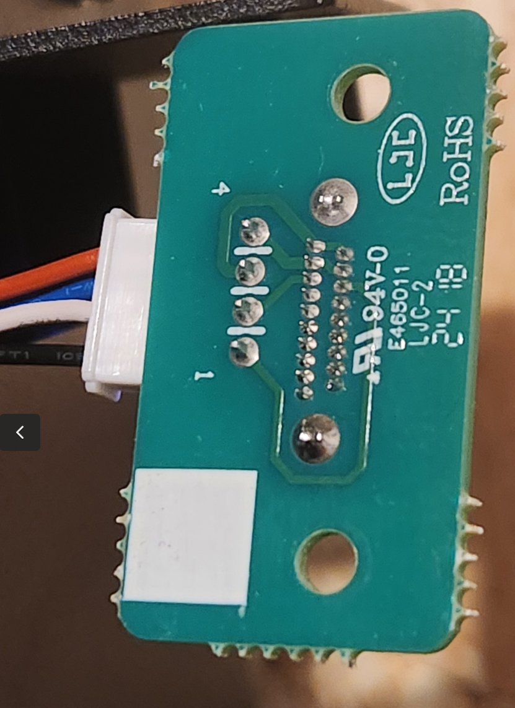
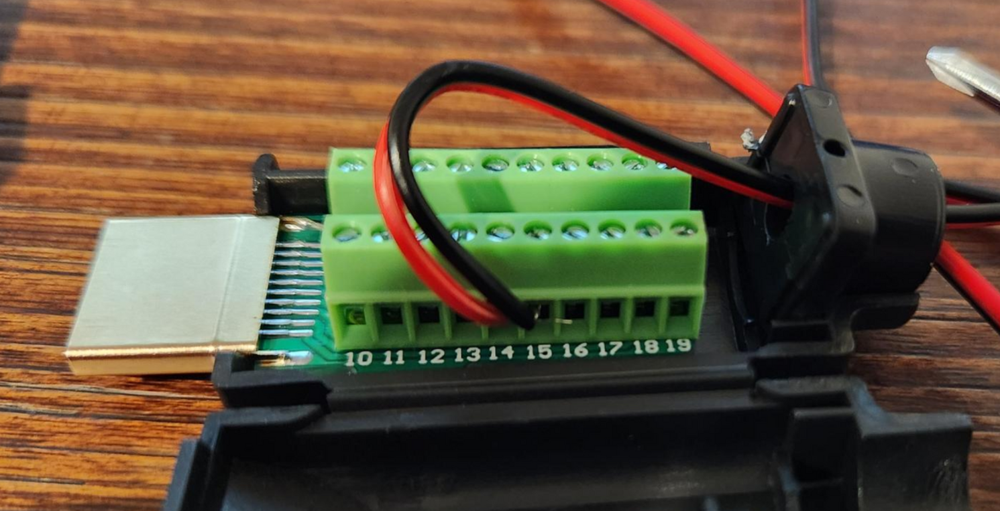

# GridBOSS setup notes

# Wired Connection

GridBOSS has INV485 port, but it does not seem to function.
It is possible to wire GridBOSS to RS485 via dongle port. Dongle
port is hooked up using [JST4 Pin connector](https://www.amazon.com/dp/B01DUC1S14):

Pins are:

1. Black: RS485 B
2. White: RS485 A
3. Blue: +5V (relative to actual ground)
4. Red: unknown (not ground!)

## HDMI adapter

EG4 dongles use HDMI plug. Use [following plug om Amazon](https://www.amazon.com/dp/B0825VBBD1)
to tap into port, and use RS485 adapter on the other end.

HDMI PINOUT:

* PIN 14: RS485 B
* PIN 15: RS485 A

